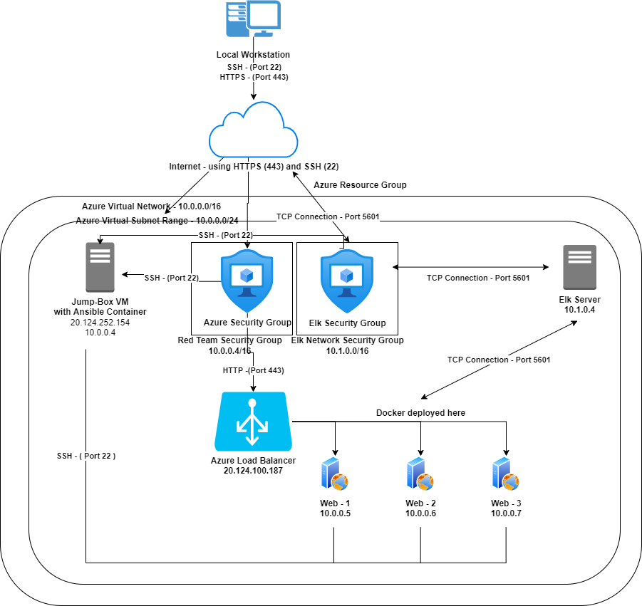

## Automated ELK Stack Deployment

The files in this repository were used to configure the network depicted below.

These files have been tested and used to generate a live ELK deployment on Azure. They can be used to either recreate the entire deployment pictured above. Alternatively, select portions of the _____ file may be used to install only certain pieces of it, such as Filebeat.

  - [ansible.cfg](/Ansible/ansible.cfg)
  - [filebeat-config.yml](/ansible/filebeat-config.yml)
  - [filebeat-playbook.yml](ansible/filebeat-playbook.yml)
  - [hosts.yml](ansible/hosts.yml)
  - [install-elk.yml](ansible/install-elk.yml)
  - [metricbeat-config.yml](ansible/metricbeat-config.yml)
  - [metricbeat-playbook.yml](ansible/metricbeat-playbook.yml)

This document contains the following details:
- Description of the Topology
- Access Policies
- ELK Configuration
  - Beats in Use
  - Machines Being Monitored
- How to Use the Ansible Build

### Description of the Topology

The main purpose of this network is to expose a load-balanced and monitored instance of DVWA, the D*mn Vulnerable Web Application.

Load balancing ensures that the application will be highly **available and reliable**, in addition to restricting **traffic** to the network.
- What aspect of security do load balancers protect? **from attackers attempting DDoS type attacks onto the system(s)** 
- What is the advantage of a jump box? **provide an additional player of security between the outside internet and internal secured network. Also, a single access point into a secure network, which limits ways an attacker could compromise a network.**

Integrating an ELK server allows users to easily monitor the vulnerable VMs for changes to the _____ and system _____.
- What does Filebeat watch for? **Filebeat watches for specific log files or directories.**
- What does Metricbeat record? **Collects metrics of services running on the server. A great monitoring tool for a network administrator.**

The configuration details of each machine may be found below.
_Note: Use the [Markdown Table Generator](http://www.tablesgenerator.com/markdown_tables) to add/remove values from the table_.

| Name       | Function   | IP Address | Operating System |
| ---------- | ---------- | ---------- | ---------------- |
| Jump Box   | Gateway    | 10.0.0.1   | Linux            |
| Web 1      | Web Server | 10.0.0.5   | Linux            |
| Web 2      | Web Server | 10.0.0.6   | Linux            |
| Web 3      | Web Server | 10.0.0.7   | Linux            |
| Elk Server | Log Server | 10.1.0.4   | Linux            |

### Access Policies

The machines on the internal network are not exposed to the public Internet. 

Only the **jump box provisioner** machine can accept connections from the Internet. Access to this machine is only allowed from the following IP addresses:
- **My personal home IP address, which I am not going to share in this document. The IP is an external IP, not an internal IP like 192.168.1.1 or 10.0.0.1.**

Machines within the network can only be accessed by _____.
- Which machine did you allow to access your ELK VM? **Jump Box Provisioner Machine ** What was its IP address? **20.124.252.154**

A summary of the access policies in place can be found in the table below.

| Name           | Publicly Accessible                                          | Allowed IP Addresses            |
| -------------- | ------------------------------------------------------------ | ------------------------------- |
| **Jump Box**   | **Yes (through SSH connection with private key)**            | **my personal home IP address** |
| **Web 1**      | **Yes (through HTTP, any web browser program)**              | **my personal home IP address** |
| **Web 2**      | **Yes (through HTTP, any web browser program)**              | **my personal home IP address** |
| **Web 3**      | **Yes (through HTTP, any web browser program)**              | **my personal home IP address** |
| **Elk Server** | **Yes (through IP with Port 5601 using HTTP with any web browser program), also I can SSH into Elk Server from Jump Box.** | **my personal home IP address** |

### Elk Configuration

Ansible was used to automate configuration of the ELK machine. No configuration was performed manually, which is advantageous because...
- What is the main advantage of automating configuration with Ansible? **Speed of deploying servers. You can automate tasks repeatedly. Also, helps eliminate spelling errors from network administrator doing a task over and over again. ** 

The playbook implements the following tasks:
- In 3-5 bullets, explain the steps of the ELK installation play. E.g., install Docker; download image; etc._
- **install docker.io**
- **install python3.pip**
- **install the docker module**
- **increase virtual memory**
- **use the sysctl module**
- **download and launch a docker elk container**

The following screenshot displays the result of running `docker ps` after successfully configuring the ELK instance.

### Target Machines & Beats
This ELK server is configured to monitor the following machines:
- List the IP addresses of the machines you are monitoring.
  - **10.0.0.5**
  - **10.0.0.6**
  - **10.0.0.7**

We have installed the following Beats on these machines:
- Specify which Beats you successfully installed.
  - **filebeat**
  - **metricbeat**

These Beats allow us to collect the following information from each machine:
- In 1-2 sentences, explain what kind of data each beat collects, and provide 1 example of what you expect to see. E.g., `Winlogbeat` collects Windows logs, which we use to track user logon events, etc.
  - **filebeat lets us monitor and collect log files generated by Azure tools, Apache, mySQL databases and Nginz web server.**
  - **metricbeat lets us collect data on the cpu and other metric of the machines (like Web 1) running.**

### Using the Playbook
In order to use the playbook, you will need to have an Ansible control node already configured. Assuming you have such a control node provisioned: 

SSH into the control node and follow the steps below:
- Copy the **playbook** file to **/etc/ansible**.
- Update the **hosts** file to include **the IP addresses of the 3 web servers and elk server.**
- Run the playbook, and navigate **to the URL (http://[Elk_Server_Public_IP]:5601/app/kibana)** to check that the installation worked as expected.

Answer the following questions to fill in the blanks:_
- Which file is the playbook? **filebeat-config.yml** 

- Where do you copy it? **to etc/ansible/files/filebeat-config.yml**

- Which file do you update to make Ansible run the playbook on a specific machine? **update the filebeat-config.yml file** 

- How do I specify which machine to install the ELK server on versus which to install Filebeat on? 

  - update host files IP addresses. 

  - see image below:

    

- Which URL do you navigate to in order to check that the ELK server is running? **http://[ELK_Server_Public_IP]:5601/app/kibana.**

_As a **Bonus**, provide the specific commands the user will need to run to download the playbook, update the files, etc._